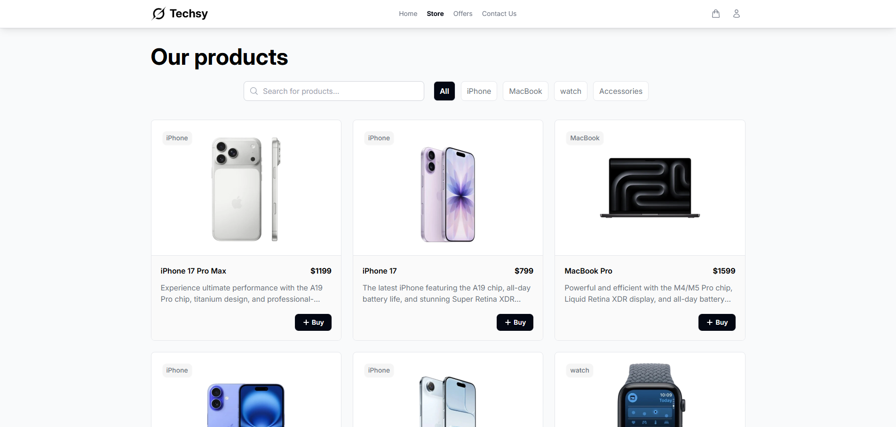
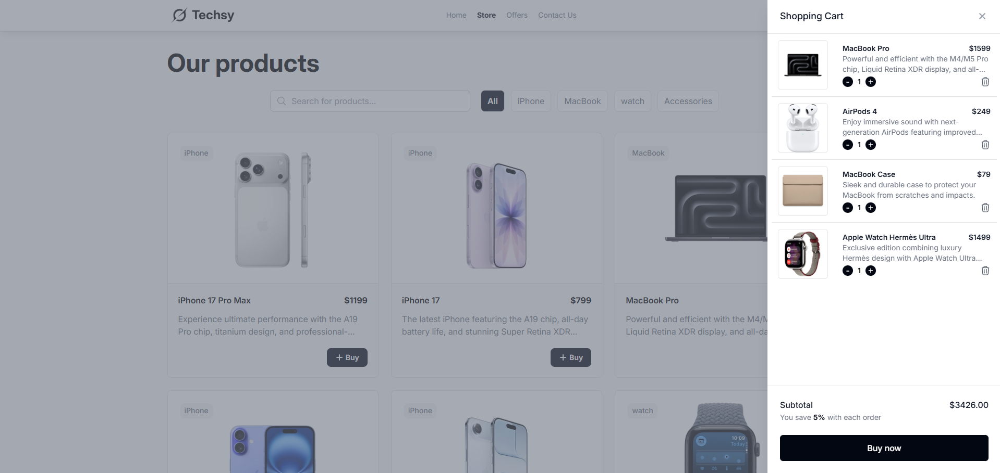

#  Techsy - Tu tienda en linea

Techsy es un demo de una tienda online web moderna que ofrece podructos de la marca Apple con fin de entretenimiento,
las tecnologias modernas de hoy en dia para una mejor navegacion y respuesta, con CONTEXTAPI y TypeScript.

🔗 Demo en línea: [https://trackify-mc.netlify.app/](https://techsy-mc.netlify.app/)

🔗 Repositorio: [https://github.com/Marcocruz01/trackify](https://github.com/Marcocruz01/techsy)

## Características

- Carrito de compras moderno.
- Manejo del tema Light/Dark.
- Productos de la marca apple.
- Estado global administrado con ContextAPI + Reducer.
- Rápida y ligera gracias a Vite.
- Interfaz moderna hecha con Tailwind CSS.
- Diseño responsivo optimizado para móvil y escritorio.
- Persistencia local datos guardados en LocalStorage.
## Tech Stack

**Cliente:** 
- React.
- TypeScript.
- Vite.
- Tailwind CSS.
- ContextAPI + Redux.

## Autor

- [@Marcocruz01](https://github.com/Marcocruz01)

## Vista General

